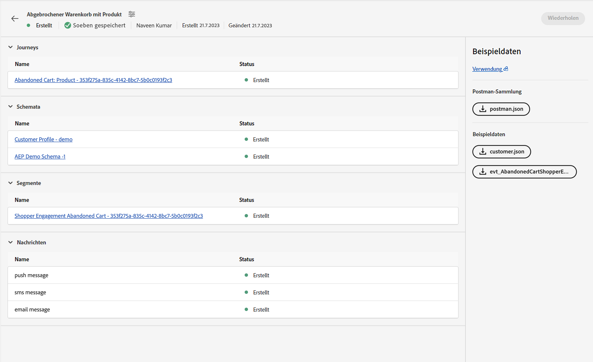
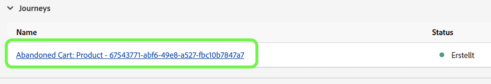
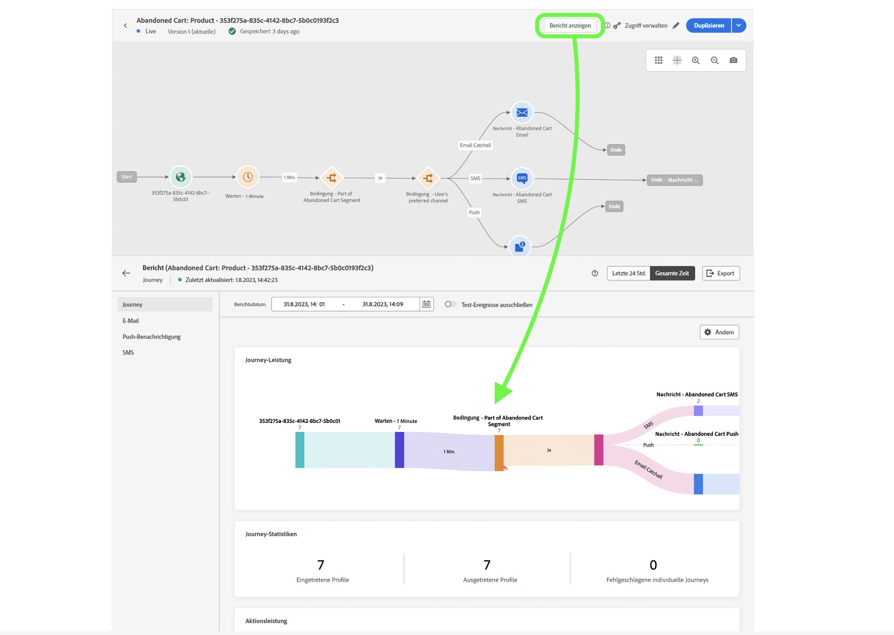

# Unitäres Ereignis

## Zu befolgende Schritte {#steps-to-follow}

>[!CONTEXTUALHELP]
>id="marketerexp_sampledata_unitaryevent"
>title="Wie wird sie verwendet?"
>abstract="Bitte folgen Sie dem Link für weitere Informationen"

>[!IMPORTANT]
>
>Diese Anweisungen können sich je nach **[!UICONTROL Playbook]** ändern, daher sollten Sie immer den Abschnitt „Beispieldaten“ im jeweiligen **[!UICONTROL Playbook]** lesen.

## Voraussetzung

* Verwenden Sie das Playbook, um die Instanzen-Assets wie **[!UICONTROL Journey]**, **[!UICONTROL Schemata]**, **[!UICONTROL Segmente]**, **[!UICONTROL Nachrichten]** usw. zu erstellen.

* Die erstellten Assets werden auf der Seite `Bill Of Material` angezeigt.

<!-- TODO: attached image needs to change once postman is removed from UI -->


>[!TIP]
>
>Wenn Sie ein Terminal zum Ausführen der cURLs verwenden, können Sie Variablenwerte festlegen, bevor Sie die cURLs ausführen, damit diese Werte nicht in einzelnen cURLs ersetzt werden müssen.
>Beispiel: Wenn Sie `ORG_ID=************@AdobeOrg` festlegen, ersetzt Shell automatisch jedes Vorkommen von `$ORG_ID` durch den Wert, damit Sie die unten aufgeführten cURLs ohne Änderung kopieren, einfügen und ausführen können.
>
> Die folgenden Variablen werden in diesem Dokument verwendet
>
> ACCESS_TOKEN
>
> API_KEY
>
> ORG_ID
>
> SANDBOX_NAME
>
> PROFILE_SCHEMA_REF
>
> PROFILE_DATASET_NAME
>
> PROFILE_DATASET_ID
>
> JOURNEY_ID
>
> PROFILE_BASE_CONNECTION_ID
>
> PROFILE_SOURCE_CONNECTION_ID
>
> PROFILE_TARGET_CONNECTION_ID
>
> PROFILE_INLET_URL
>
> CUSTOMER_MOBILE_NUMBER
>
> CUSTOMER_FIRST_NAME
>
> CUSTOMER_LAST_NAME
>
> EMAIL
>
> EVENT_SCHEMA_REF
>
> EVENT_DATASET_NAME
>
> EVENT_DATASET_ID
>
> EVENT_BASE_CONNECTION_ID
>
> EVENT_SOURCE_CONNECTION_ID
>
> EVENT_TARGET_CONNECTION_ID
>
> EVENT_INLET_URL
>
> TIMESTAMP
>
> UNIQUE_EVENT_ID

## Abrufen des IMS-Tokens

1. Bitte folgen Sie der Dokumentation [Authentifizieren und Aufrufen von Experience Platform-APIs](https://experienceleague.adobe.com/docs/experience-platform/landing/platform-apis/api-authentication.html?lang=de), um das Zugriffs-Token zu generieren.

## Veröffentlichen der vom Playbook erstellten Journey

Es gibt zwei Möglichkeiten, die Journey zu veröffentlichen. Sie können beliebig zwischen ihnen wählen:

1. **Verwenden der AJO-Benutzeroberfläche** – Klicken Sie auf den Journey-Link auf der `Bill Of Material Page`. Dadurch werden Sie zur Journey-Seite umgeleitet, wo Sie auf die Schaltfläche **[!UICONTROL Veröffentlichen]** klicken können, damit die Journey veröffentlicht wird.

   

1. **Verwenden von cURL**

   1. Veröffentlichen Sie die Journey. Die Antwort enthält die Auftrags-ID, die im nächsten Schritt benötigt wird, um den Veröffentlichungsstatus der Journey abzurufen.

      ```bash
      curl --location --request POST "https://journey-private.adobe.io/authoring/jobs/journeyVersions/$JOURNEY_ID/deploy" \
      --header "Accept: */*" \
      --header "Authorization: Bearer $ACCESS_TOKEN" \
      --header "x-api-key: $API_KEY" \
      --header "x-gw-ims-org-id: $ORG_ID" \
      --header "x-sandbox-name: $SANDBOX_NAME" \
      --header "Content-Type: application/json" 
      ```

   1. Die Veröffentlichung einer Journey kann einige Zeit in Anspruch nehmen. Um den Status zu überprüfen, führen Sie die folgende cURL aus, bis `response.status` `SUCCESS` ist. Warten Sie 10–15 Sekunden, wenn die Veröffentlichung der Journey einige Zeit dauert.

      ```bash
      curl --location "https://journey-private.adobe.io/authoring/jobs/$JOB_ID" \
      --header "Authorization: Bearer $ACCESS_TOKEN" \
      --header "x-api-key: $API_KEY" \
      --header "x-gw-ims-org-id: $ORG_ID" \
      --header "x-sandbox-name: $SANDBOX_NAME" \
      --header "Content-Type: application/json"
      ```

## Aufnehmen des Kundenprofils

>[!TIP]
>
>Wenn Ihr E-Mail-Anbieter Plus-E-Mails unterstützt, können Sie dieselbe E-Mail-Adresse wiederverwenden, indem Sie `+<variable>` an Ihre E-Mail-Adresse anhängen. Beispielsweise kann `usertest@email.com` als `usertest+v1@email.com` oder `usertest+24jul@email.com` wiederverwendet werden. Dies kann hilfreich sein, wenn jedes Mal ein neues Profil, jedoch mit derselben E-Mail-ID, verwendet werden soll.
>
>P.S.: Plus-E-Mails sind eine konfigurierbare Funktion, die vom E-Mail-Anbieter unterstützt werden muss. Prüfen Sie bitte, ob Sie E-Mails an solche Adressen erhalten können, bevor Sie sie im Test verwenden.

1. Erstmalige Benutzerinnen und Benutzer müssen das **[!DNL customer dataset]** und die **[!DNL HTTP Streaming Inlet Connection]** erstellen.
1. Wenn Sie bereits das **[!DNL customer dataset]** und die **[!DNL HTTP Streaming Inlet Connection]** erstellt haben, fahren Sie bitte mit dem Schritt `5` fort.
1. Erstellen Sie einen Kundenprofil-Datensatz, indem Sie die folgende cURL ausführen.

   ```bash
   curl --location "https://platform.adobe.io/data/foundation/catalog/dataSet" \
   --header "Authorization: Bearer $ACCESS_TOKEN" \
   --header "x-gw-ims-org-id: $ORG_ID" \
   --header "x-sandbox-name: $SANDBOX_NAME" \
   --header "x-api-key: $API_KEY" \
   --header "Content-Type: application/json" \
   --data '{
       "name": "'$PROFILE_DATASET_NAME'",
       "schemaRef": {
           "id": "'$PROFILE_SCHEMA_REF'",
           "contentType": "application/vnd.adobe.xed-full-notext+json; version=1"
       },
       "tags": {
           "unifiedProfile": [
           "enabled:true"
           ],
           "unifiedIdentity": [
           "enabled:true"
           ]
       },
       "fileDescription": {
           "persisted": true,
           "containerFormat": "parquet",
           "format": "parquet"
       }
   }'
   ```

   Die Antwort hat das Format `"@/dataSets/<PROFILE_DATASET_ID>"`.

1. Erstellen Sie **[!DNL HTTP Streaming Inlet Connection]** mithilfe der folgenden Schritte.
   1. Erstellen Sie eine Basisverbindung.

      ```bash
      curl --location "https://platform.adobe.io/data/foundation/flowservice/connections?Cache-Control=no-cache" \
      --header "Authorization: Bearer $ACCESS_TOKEN" \
      --header "x-gw-ims-org-id: $ORG_ID" \
      --header "x-sandbox-name: $SANDBOX_NAME" \
      --header "x-api-key: $API_KEY" \
      --header "Content-Type: application/json" \
      --data '{
          "name": "AbandonedCartProduct_Base_ConnectionForCustomerProfile_1694458293",
          "description": "Marketer Playground Playbook-Validation Customer Profile Base Connection 1",
          "auth": {
              "specName": "Streaming Connection",
              "params": {
                  "dataType": "xdm"
              }
          },
          "connectionSpec": {
              "id": "bc7b00d6-623a-4dfc-9fdb-f1240aeadaeb",
              "version": "1.0"
          }
      }'
      ```

      Beziehen der ID der Basisverbindung aus der Antwort und Verwenden der ID anstelle von `PROFILE_BASE_CONNECTION_ID` in den folgenden cURLs

   1. Erstellen Sie die Quellverbindung.

      ```bash
      curl --location "https://platform.adobe.io/data/foundation/flowservice/sourceConnections" \
      --header "Authorization: Bearer $ACCESS_TOKEN" \
      --header "x-gw-ims-org-id: $ORG_ID" \
      --header "x-sandbox-name: $SANDBOX_NAME" \
      --header "Content-Type: application/json" \
      --header "x-api-key: $API_KEY" \
      --data '{
          "name": "AbandonedCartProduct_Source_ConnectionForCustomerProfile_1694458318",
          "description": "Marketer Playground Playbook-Validation Customer Profile Source Connection 1",
          "baseConnectionId": "'$PROFILE_BASE_CONNECTION_ID'",
          "connectionSpec": {
              "id": "bc7b00d6-623a-4dfc-9fdb-f1240aeadaeb",
              "version": "1.0"
          }
      }'
      ```

      Abrufen der ID der Quellverbindung aus der Antwort und Verwenden der ID anstelle von `PROFILE_SOURCE_CONNECTION_ID`

   1. Erstellen Sie eine Zielverbindung.

      ```bash
      curl --location "https://platform.adobe.io/data/foundation/flowservice/targetConnections" \
      --header "Authorization: Bearer $ACCESS_TOKEN" \
      --header "x-gw-ims-org-id: $ORG_ID" \
      --header "x-sandbox-name: $SANDBOX_NAME" \
      --header "Content-Type: application/json" \
      --header "x-api-key: $API_KEY" \
      --data '{
          "name": "AbandonedCartProduct_Target_ConnectionForCustomerProfile_1694458407",
          "description": "Marketer Playground Playbook-Validation Customer Profile Target Connection 1",
          "data": {
              "format": "parquet_xdm",
              "schema": {
                  "version": "application/vnd.adobe.xed-full+json;version=1",
                  "id": "'$PROFILE_SCHEMA_REF'"
              },
              "properties": null
          },
          "connectionSpec": {
              "id": "c604ff05-7f1a-43c0-8e18-33bf874cb11c",
              "version": "1.0"
          },
          "params": {
              "dataSetId": "'$PROFILE_DATASET_ID'"
          }
      }'
      ```

      Abrufen der ID der Zielverbindung aus der Antwort und Verwenden der ID anstelle von `PROFILE_TARGET_CONNECTION_ID`

   1. Erstellen Sie einen Datenfluss.

      ```bash
      curl --location "https://platform.adobe.io/data/foundation/flowservice/flows" \
      --header "Authorization: Bearer $ACCESS_TOKEN" \
      --header "x-gw-ims-org-id: $ORG_ID" \
      --header "x-sandbox-name: $SANDBOX_NAME" \
      --header "Content-Type: application/json" \
      --header "x-api-key: $API_KEY" \
      --data '{
          "name": "AbandonedCartProduct_Dataflow_ForCustomerCustomerProfile_1694460528",
          "description": "Marketer Playground Playbook-Validation Customer Profile Dataflow 1",
          "flowSpec": {
              "id": "d8a6f005-7eaf-4153-983e-e8574508b877",
              "version": "1.0"
          },
          "sourceConnectionIds": [
              "'$PROFILE_SOURCE_CONNECTION_ID'"
          ],
          "targetConnectionIds": [
              "'$PROFILE_TARGET_CONNECTION_ID'"
          ]
      }'
      ```

   1. Rufen Sie die Basisverbindung ab. Das Ergebnis enthält inletUrl, das zum Senden von Profildaten erforderlich ist.

      ```bash
      curl --location "https://platform.adobe.io/data/foundation/flowservice/connections/$PROFILE_BASE_CONNECTION_ID" \
      --header "Authorization: Bearer $ACCESS_TOKEN" \
      --header "x-gw-ims-org-id: $ORG_ID" \
      --header "x-sandbox-name: $SANDBOX_NAME" \
      --header "Content-Type: application/json" \
      --header "x-api-key: $API_KEY"
      ```

      Abrufen der inletUrl aus der Antwort und Verwenden der inletUrl anstelle von `PROFILE_INLET_URL`

1. In diesem Schritt muss die Benutzerin bzw. der Benutzer die Werte `PROFILE_DATASET_ID` und `PROFILE_INLET_URL` haben. Ist dies nicht der Fall, lesen Sie bitte den Schritt `3` bzw. `4`.
1. Um die Kundin oder den Kunden zu erfassen, muss die Benutzerin bzw. der Benutzer `CUSTOMER_MOBILE_NUMBER`, `CUSTOMER_FIRST_NAME`, `CUSTOMER_LAST_NAME` und `EMAIL` in den folgenden cURLs ersetzen.

   1. `CUSTOMER_MOBILE_NUMBER` ist die Handynummer, z. B. `+1 000-000-0000`
   1. `CUSTOMER_FIRST_NAME` ist der Vorname der Benutzerin bzw. des Benutzers
   1. `CUSTOMER_LAST_NAME` ist der Nachname der Benutzerin bzw. des Benutzers
   1. `EMAIL` ist die E-Mail-Adresse der Benutzerin bzw. des Benutzers. Es ist wichtig, eine eindeutige E-Mail-Adresse zu verwenden, damit ein neues Profil aufgenommen werden kann.

1. Führen Sie schließlich die cURL aus, um das Kundenprofil aufzunehmen. Aktualisieren Sie `body.xdmEntity.consents.marketing.preferred` auf `email`, `sms` oder `push` basierend auf den Kanälen, die Sie verifizieren möchten. Setzen Sie `val` entsprechend auch auf `y` fest.

   ```bash
   curl --location "$PROFILE_INLET_URL?synchronousValidation=true" \
   --header 'Content-Type: application/json' \
   --data-raw '{
       "header": {
           "schemaRef": {
               "id": "'$PROFILE_SCHEMA_REF'",
               "contentType": "application/vnd.adobe.xed-full+json;version=1.0"
           },
           "imsOrgId": "'$ORG_ID'",
           "datasetId": "'$PROFILE_DATASET_ID'",
           "source": {
               "name": "Streaming dataflow - 1694460605"
           }
       },
       "body": {
           "xdmMeta": {
               "schemaRef": {
                   "id": "'$PROFILE_SCHEMA_REF'",
                   "contentType": "application/vnd.adobe.xed-full+json;version=1.0"
               }
           },
           "xdmEntity": {
           "consents": {
               "marketing": {
                   "preferred": "email",
                   "email": {
                       "val": "y"
                   },
                   "push": {
                       "val": "n"
                   },
                   "sms": {
                       "val": "n"
                   }
               }
           },
           "mobilePhone": {
               "number": "'$CUSTOMER_MOBILE_NUMBER'",
               "status": "active"
           },
           "person": {
               "name": {
               "firstName": "'$CUSTOMER_FIRST_NAME'",
               "lastName": "'$CUSTOMER_LAST_NAME'"
               }
           },
           "personalEmail": {
               "address": "'$EMAIL'"
           },
           "testProfile": false
           }
       }
   }'
   ```

## Aufnehmen eines Journey-Trigger-Ereignisses

1. Erstmalige Benutzerinnen bzw. Benutzer müssen das **[!DNL event dataset]** und die **[!DNL HTTP Streaming Inlet Connection for events]** erstellen
1. Wenn Sie bereits das **[!DNL event dataset]** und die **[!DNL HTTP Streaming Inlet Connection for events]** erstellt haben, fahren Sie bitte mit dem Schritt `5` fort.
1. Erstellen Sie einen Ereignis-Datensatz, indem Sie die folgende cURL ausführen.

   ```bash
   curl --location "https://platform.adobe.io/data/foundation/catalog/dataSet" \
   --header "Authorization: Bearer $ACCESS_TOKEN" \
   --header "x-gw-ims-org-id: $ORG_ID" \
   --header "x-sandbox-name: $SANDBOX_NAME" \
   --header "x-api-key: $API_KEY" \
   --header "Content-Type: application/json" \
   --data '{
       "name": "'$EVENT_DATASET_NAME'",
       "schemaRef": {
           "id": "'$EVENT_SCHEMA_REF'",
           "contentType": "application/vnd.adobe.xed-full-notext+json; version=1"
       },
       "tags": {
           "unifiedProfile": [
               "enabled:true"
           ],
           "unifiedIdentity": [
               "enabled:true"
           ]
       },
       "fileDescription": {
           "persisted": true,
           "containerFormat": "parquet",
           "format": "parquet"
       }
   }'
   ```

   Die Antwort hat das Format `"@/dataSets/<EVENT_DATASET_ID>"`

1. Erstellen Sie **[!DNL HTTP Streaming Inlet Connection for events]** mithilfe der folgenden Schritte.
   <!-- TODO: Is the name unique? If so, we may need to generate and provide in variables.txt-->
   1. Erstellen Sie eine Basisverbindung.

      ```bash
      curl --location "https://platform.adobe.io/data/foundation/flowservice/connections?Cache-Control=no-cache" \
      --header "Authorization: Bearer $ACCESS_TOKEN" \
      --header "x-gw-ims-org-id: $ORG_ID" \
      --header "x-sandbox-name: $SANDBOX_NAME" \
      --header "x-api-key: $API_KEY" \
      --header "Content-Type: application/json" \
      --data '{
          "name": "AbandonedCartProduct_Base_ConnectionForAEPDemoSchema_1694461448",
          "description": "Marketer Playground Playbook-Validation AEP Demo Schema Base Connection 1",
          "auth": {
              "specName": "Streaming Connection",
              "params": {
                  "dataType": "xdm"
              }
          },
          "connectionSpec": {
              "id": "bc7b00d6-623a-4dfc-9fdb-f1240aeadaeb",
              "version": "1.0"
          }
      }'
      ```

      Beziehen der ID der Basisverbindung aus der Antwort und Verwenden der ID anstelle von `EVENT_BASE_CONNECTION_ID`

   1. Erstellen Sie die Quellverbindung.

      ```bash
      curl --location "https://platform.adobe.io/data/foundation/flowservice/sourceConnections" \
      --header "Authorization: Bearer $ACCESS_TOKEN" \
      --header "x-gw-ims-org-id: $ORG_ID" \
      --header "x-sandbox-name: $SANDBOX_NAME" \
      --header "x-api-key: $API_KEY" \
      --header "Content-Type: application/json" \
      --data '{
          "name": "AbandonedCartProduct_Source_ConnectionForAEPDemoSchema_1694461464",
          "description": "Marketer Playground Playbook-Validation AEP Demo Schema Source Connection 1",
          "baseConnectionId": "'$EVENT_BASE_CONNECTION_ID'",
          "connectionSpec": {
              "id": "bc7b00d6-623a-4dfc-9fdb-f1240aeadaeb",
              "version": "1.0"
          }
      }'
      ```

      Abrufen der ID der Quellverbindung aus der Antwort und Verwenden der ID anstelle von `EVENT_SOURCE_CONNECTION_ID`

   1. Erstellen Sie eine Zielverbindung.

      ```bash
      curl --location "https://platform.adobe.io/data/foundation/flowservice/sourceConnections" \
      --header "Authorization: Bearer $ACCESS_TOKEN" \
      --header "x-gw-ims-org-id: $ORG_ID" \
      --header "x-sandbox-name: $SANDBOX_NAME" \
      --header "x-api-key: $API_KEY" \
      --header "Content-Type: application/json" \
      --data '{
          "name": "AbandonedCartProduct_Target_ConnectionForAEPDemoSchema_1694802667",
          "description": "Marketer Playground Playbook-Validation AEP Demo Schema Target Connection 1",
          "data": {
              "format": "parquet_xdm",
              "schema": {
                  "version": "application/vnd.adobe.xed-full+json;version=1",
                  "id": "'$EVENT_SCHEMA_REF'"
              },
              "properties": null
          },
          "connectionSpec": {
              "id": "c604ff05-7f1a-43c0-8e18-33bf874cb11c",
              "version": "1.0"
          },
          "params": {
              "dataSetId": "'$EVENT_DATASET_ID'"
          }
      }'
      ```

      Abrufen der ID der Zielverbindung aus der Antwort und Verwenden der ID anstelle von `EVENT_TARGET_CONNECTION_ID`

   1. Erstellen Sie einen Datenfluss.

      ```bash
      curl --location "https://platform.adobe.io/data/foundation/flowservice/flows" \
      --header "Authorization: Bearer $ACCESS_TOKEN" \
      --header "x-gw-ims-org-id: $ORG_ID" \
      --header "x-sandbox-name: $SANDBOX_NAME" \
      --header "x-api-key: $API_KEY" \
      --header "Content-Type: application/json" \
      --data '{
          "name": "AbandonedCartProduct_Dataflow_ForCustomerAEPDemoSchema_1694461564",
          "description": "Marketer Playground Playbook-Validation AEP Demo Schema Dataflow 1",
          "flowSpec": {
              "id": "d8a6f005-7eaf-4153-983e-e8574508b877",
              "version": "1.0"
          },
          "sourceConnectionIds": [
              "'$EVENT_SOURCE_CONNECTION_ID'"
          ],
          "targetConnectionIds": [
              "'$EVENT_TARGET_CONNECTION_ID'"
          ]
      }'
      ```

   1. Rufen Sie die Basisverbindung ab. Das Ergebnis enthält inletUrl, das zum Senden von Profildaten erforderlich ist.

   ```bash
   curl --location "https://platform.adobe.io/data/foundation/flowservice/connections/$EVENT_BASE_CONNECTION_ID" \
       --header "Authorization: Bearer $ACCESS_TOKEN" \
       --header "x-gw-ims-org-id: $ORG_ID" \
       --header "x-sandbox-name: $SANDBOX_NAME" \
       --header "x-api-key: $API_KEY" \
       --header "Content-Type: application/json" 
   ```

   Abrufen der inletUrl aus der Antwort und Verwenden der inletUrl anstelle von `EVENT_INLET_URL`

1. In diesem Schritt muss die Benutzerin bzw. der Benutzer die Werte `EVENT_DATASET_ID` und `EVENT_INLET_URL` haben. Ist dies nicht der Fall, lesen Sie bitte den Schritt `3` bzw. `4`.
1. Um ein Ereignis aufzunehmen, muss die Benutzerin bzw. der Benutzer die Zeitvariable `TIMESTAMP` im Anfragetext der folgenden cURL ändern.

   1. Ersetzen Sie `body.xdmEntity` durch die Inhalte der heruntergeladenen Ereignis-JSON.
   1. `TIMESTAMP` ist der Zeitpunkt, als das Ereignis aufgetreten ist. Verwenden Sie den Zeitstempel in der UTC-Zeitzone, z. B. `2023-09-05T23:57:00.071+00:00`.
   1. Legen Sie einen eindeutigen Wert für die Variable `UNIQUE_EVENT_ID` fest.

   ```bash
   curl --location "$EVENT_INLET_URL?synchronousValidation=true" \
   --header 'Content-Type: application/json' \
   --data-raw '{
       "header": {
           "schemaRef": {
               "id": "'$EVENT_SCHEMA_REF'",
               "contentType": "application/vnd.adobe.xed-full+json;version=1.0"
           },
           "imsOrgId": "'$ORG_ID'",
           "datasetId": "'$EVENT_DATASET_ID'",
           "source": {
               "name": "Streaming dataflow - 8/31/2023 9:04:25 PM"
           }
       },
       "body": {
           "xdmMeta": {
               "schemaRef": {
                   "id": "'$EVENT_SCHEMA_REF'",
                   "contentType": "application/vnd.adobe.xed-full+json;version=1.0"
               }
           },
           "xdmEntity": {
               "endUserIDs": {
                   "_experience": {
                       "aaid": {
                           "id": "'$EMAIL'"
                       },
                       "emailid": {
                           "id": "'$EMAIL'"
                       }
                   }
               },
               "_experience": {
                   "analytics": {
                       "customDimensions": {
                           "eVars": {
                           "eVar235": "AC11147"
                           }
                       }
                   }
               },
               "_id": "'$UNIQUE_EVENT_ID'",
               "commerce": {
                   "productListAdds": {
                       "value": 11498
                   }
               },
               "eventType": "commerce.productListAdds",
               "productListItems": [
                   {
                       "_id": "ACS1620",
                       "SKU": "P1",
                       "_experience": {
                           "analytics": {
                           "customDimensions": {
                               "eVars": {
                                   "eVar1": "Pants"
                               }
                           }
                           }
                       },
                       "currencyCode": "USD",
                       "name": "Sample value",
                       "priceTotal": 30841.13,
                       "product": "https://ns.adobe.com/xdm/common/uri",
                       "productAddMethod": "Sample value",
                       "quantity": 1
                   },
                   {
                       "_id": "ACS1729",
                       "SKU": "P2",
                       "_experience": {
                           "analytics": {
                               "customDimensions": {
                                   "eVars": {
                                       "eVar1": "Galliano"
                                   }
                               }
                           }
                       },
                       "currencyCode": "USD",
                       "name": "Sample value",
                       "priceTotal": 20841.13,
                       "product": "https://ns.adobe.com/xdm/common/uri",
                       "productAddMethod": "Sample value",
                       "quantity": 2
                   }
               ],
               "timestamp": "'$TIMESTAMP'",
               "web": {
                   "webInteraction": {
                       "URL": "https://experienceleague.adobe.com/docs/experience-platform/edge/data-collection/collect-commerce-data.html?lang=en",
                       "name": "Sample value",
                       "region": "Sample value"
                   },
                   "webPageDetails": {
                       "URL": "https://experienceleague.adobe.com/docs/experience-platform/edge/data-collection/collect-commerce-data.html?lang=en",
                       "isErrorPage": false,
                       "isHomePage": false,
                       "name": "Sample value",
                       "pageViews": {
                           "id": "Sample value",
                           "value": 1
                       },
                       "server": "Sample value",
                       "siteSection": "Sample value",
                       "viewName": "Sample value"
                   },
                   "webReferrer": {
                   "URL": "Sample value",
                   "type": "internal"
                   }
               }
           }
       }
   }'
   ```

## Abschließende Validierung

Sie müssen eine Nachricht auf dem von Ihnen gewählten bevorzugten Kanal erhalten, der in **[!DNL Ingest the Customer Profile]** im Schritt `8` verwendet wird.

* `SMS`, wenn der bevorzugte Kanal `sms` für `customer_country_code` und `customer_mobile_no` ist
* `Email` wenn der bevorzugte Kanal `email` für `email` ist

Alternativ können Sie auch `Journey Report` überprüfen. Klicken Sie dazu auf `Journey Object` auf der `Bill of Materials page`, und Sie werden zur `Journey Details page` weitergeleitet.

Für jede veröffentlichte Journey muss die Benutzerin bzw. der Benutzer eine Schaltfläche **[!UICONTROL Bericht anzeigen]** erhalten



## Bereinigen

Bitte lassen Sie nicht mehrere Instanzen von `Journey` gleichzeitig laufen, sondern stoppen Sie die Journey, wenn sie nur zur Validierung dient, sobald die Validierung abgeschlossen ist.
