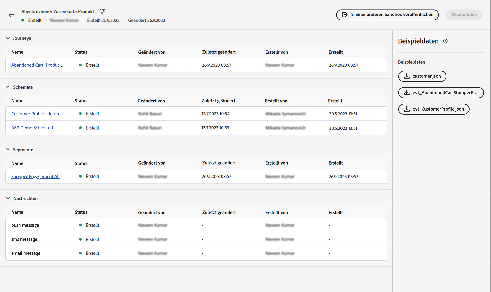

# Einzelereignis

## Schritte, die ausgeführt werden müssen {#steps-to-follow}

>[!CONTEXTUALHELP]
>id="marketerexp_sampledata_unitaryevent"
>title="Wie ist es anzuwenden?"
>abstract="Weitere Informationen finden Sie unter dem Link ."

>[!IMPORTANT]
>
>Diese Anweisungen ändern sich möglicherweise in **[!UICONTROL Playbook]** Daher sollten Sie immer den Abschnitt Beispieldaten der jeweiligen **[!UICONTROL Playbook]**.

## Voraussetzung

* Sie müssen die Postman-Software installiert haben
* Verwenden Sie das Playbook, um Instanzen wie **[!UICONTROL Journey]**, **[!UICONTROL Schemas]**, **[!UICONTROL Segmente]**, **[!UICONTROL Nachrichten]** usw.

Erstellte Assets werden in `Bill Of Material` Seite



## Postman mit erforderlicher Sammlung vorbereiten

1. Besuch **[!UICONTROL Anwendungsbeispiel Playbook]** Anwendung.
1. Klicken Sie auf die entsprechenden **[!UICONTROL Playbook]** Karte zum Besuch **[!UICONTROL Playbook]** Detailseite.
1. Besuch **[!UICONTROL Materialrechnung]** und suchen Sie nach **[!UICONTROL Beispieldaten]** Abschnitt.
1. Laden Sie die `postman.json` durch Klicken auf die entsprechenden Schaltflächen in der Benutzeroberfläche.
1. Import `postman.json` im **[!DNL Postman Software]**.
1. Erstellen Sie eine dedizierte Postman-Umgebung für diese Validierung (z. B. `Adobe <PLAYBOOK_NAME>`).

## Abrufen des IMS-Tokens

>[!NOTE]
>
>Bei allen Umgebungsvariablen wird zwischen Groß- und Kleinschreibung unterschieden. Verwenden Sie daher immer den genauen Variablennamen.

1. Bitte folgen Sie [Experience Platform-APIs authentifizieren und aufrufen](https://experienceleague.adobe.com/docs/experience-platform/landing/platform-apis/api-authentication.html) Dokumentation zum Generieren des Zugriffstokens.
1. Speichern Sie den Zugriffstoken -Wert in Umgebungsvariablen mit dem Namen `ACCESS_TOKEN`.
1. Andere authentifizierungsbezogene Werte wie speichern `API_KEY`, `IMS_ORG` und `SANDBOX_NAME` in Umgebungsvariablen.

>[!IMPORTANT]
>
>Stellen Sie vor dem Ausführen einer API aus Postman sicher, dass alle erforderlichen Umgebungsvariablen hinzugefügt werden müssen.

## Veröffentlichen der von Playbook erstellten Journey

Es gibt 2 Möglichkeiten, die Journey zu veröffentlichen. Sie können eine davon auswählen:

1. **Verwenden der AJO-Benutzeroberfläche** - Klicken Sie auf den Journey-Link auf `Bill Of Material Page`Sie werden zur Journey-Seite weitergeleitet, auf die Sie klicken können. **[!UICONTROL Veröffentlichen]** Schaltfläche und Journey veröffentlicht werden.

   

1. **Verwenden der Postman-API**

   1. Trigger **[!DNL Publish Journey]** Anfrage von **[!DNL Journey Publish]** > **[!DNL Queue journey publish job]**.
   1. Journey-Publish kann einige Zeit in Anspruch nehmen. Um den Status zu überprüfen, führen Sie die API zum Überprüfen des Journey-Veröffentlichungsstatus aus, bis die `response.status` is `SUCCESS`, stellen Sie sicher, dass Sie 10-15 Sekunden warten, wenn die Journey-Veröffentlichung zeitaufwendig ist.

   >[!NOTE]
   >
   >Bei allen Umgebungsvariablen wird zwischen Groß- und Kleinschreibung unterschieden. Verwenden Sie daher immer den genauen Variablennamen.

## Kundenprofil erfassen

>[!TIP]
>
>Sie können dieselbe E-Mail-Adresse wiederverwenden, indem Sie `+<variable>` in Ihre E-Mail, z. B. `usertest@email.com` kann fortgesetzt werden als `usertest+v1@email.com` oder `usertest+24jul@email.com`. Dies wäre hilfreich, jedes Mal ein neues Profil zu haben, aber immer noch dieselbe E-Mail-ID zu verwenden.

1. Erstmaliger Benutzer muss die **[!DNL customer dataset]** und **[!DNL HTTP Streaming Inlet Connection]**.
1. Wenn Sie bereits die **[!DNL customer dataset]** und **[!DNL HTTP Streaming Inlet Connection]**, überspringen Sie bitte zum Schritt . `5`.
1. Trigger **[!DNL Customer Profile Ingestion]** > **[!DNL Create Customer Profile InletId]** > **[!DNL Create Dataset]** erstellen **[!DNL customer dataset]** wird ein `CustomerProfile_dataset_id` in Postman-Umgebungsvariablen.
1. Erstellen **[!DNL HTTP Streaming Inlet Connection]**, verwenden Sie Postman-APIs unter **[!DNL Customer Profile Ingestion > Create Customer Profile InletId]**.

   1. `CustomerProfile_dataset_id` muss in Postman-Umgebungsvariablen verfügbar sein, falls nicht, siehe Schritt `3`.
   1. Trigger **[!DNL `CREATE Base Connection`]** nach [!DNL create base connection].
   1. Trigger **[!DNL `CREATE Source Connection`]** nach [!DNL create source connection].
   1. Trigger **[!DNL `CREATE Target Connection`]** nach [!DNL create target connection].
   1. Trigger **[!DNL `CREATE Dataflow`]** nach [!DNL create dataflow].
   1. Trigger **[!DNL `GET Base Connection`]**- wird automatisch gespeichert. `CustomerProfile_inlet_id` in den postman-Umgebungsvariablen.

1. In diesem Schritt müssen Sie `CustomerProfile_dataset_id` und `CustomerProfile_inlet_id` in Postman-Umgebungsvariablen; falls nicht, lesen Sie Schritt . `3` oder `4` bzw.
1. Um Kunden zu erfassen, muss der Benutzer `customer_country_code`, `customer_mobile_no`, `customer_first_name`, `customer_last_name` und `email` in Postman-Umgebungsvariablen.

   1. `customer_country_code` würde die Ländervorwahl der Mobiltelefonnummer sein, z. B. `91` oder `1`
   1. `customer_mobile_no` eine Mobiltelefonnummer sein, z. B. `9987654321`
   1. `customer_first_name` wäre der Vorname des Benutzers
   1. `customer_last_name` wäre der Nachname des Benutzers
   1. `email` die E-Mail-Adresse des Benutzers ist, ist dies wichtig, um eine eindeutige E-Mail-ID zu verwenden, damit ein neues Profil erfasst werden kann.

1. Postman-Anforderung aktualisieren **[!DNL Customer Ingestion]** > **[!DNL Customer Streaming Ingestion]** den bevorzugten Kanal des Kunden zu ändern; standardmäßig [!DNL `email`] wird in der Anfrage konfiguriert.

   ```js
   "consents": {
       "marketing": {
           "preferred": "email",
           "email": {
               "val": "y"
           },
           "push": {
               "val": "n"
           },
           "sms": {
               "val": "n"
           }
       }
   }
   ```

1. Ändern des bevorzugten Kanals in `sms` oder `push` und geben Sie den entsprechenden Kanalwert an `y` und `n` auf andere Werte, z. B.

   ```js
   "consents": {
       "marketing": {
           "preferred": "sms",
           "email": {
               "val": "n"
           },
           "push": {
               "val": "n"
           },
           "sms": {
               "val": "y"
           }
       }
   }
   ```

1. Endlicher Trigger **[!DNL `Customer Profile Ingestion > Customer Profile Streaming Ingestion`]** , um das Kundenprofil aufzunehmen.

## Aufnahmeereignis

1. Erstmalige Erstellung des **[!DNL event dataset]** und **[!DNL HTTP Streaming Inlet Connection for events]**
1. Wenn Sie bereits die **[!DNL event dataset]** und **[!DNL HTTP Streaming Inlet Connection for events]**, überspringen Sie bitte zum Schritt . `5`.
1. Trigger **[!DNL `Schemas Data Ingestion > AEP Demo Schema Ingestion > Create AEP Demo Schema InletId > Create Dataset`]** erstellen **[!DNL event dataset]**, speichert dies eine `AEPDemoSchema_dataset_id` in Postman-Umgebungsvariablen
1. Erstellen **[!DNL HTTP Streaming Inlet Connection for events]**, verwenden Sie Postman-APIs unter **[!DNL Schemas Data Ingestion]** > **[!DNL AEP Demo Schema Ingestion]** > **[!DNL Create AEP Demo Schema InletId]**.

   1. `AEPDemoSchema_dataset_id` muss in Postman-Umgebungsvariablen verfügbar sein, falls nicht, siehe Schritt `3`
   1. Trigger **[!DNL `CREATE Base Connection`]** nach [!DNL create base connection]
   1. Trigger **[!DNL `CREATE Source Connection`]** nach [!DNL create source connection]
   1. Trigger **[!DNL `CREATE Target Connection`]** nach [!DNL create target connection]
   1. Trigger **[!DNL `CREATE Dataflow`]** nach [!DNL create dataflow]
   1. Trigger **[!DNL `GET Base Connection`]**- wird automatisch gespeichert. `AEPDemoSchema_inlet_id` in den postman-Umgebungsvariablen

1. In diesem Schritt müssen Sie `AEPDemoSchema_dataset_id` und `AEPDemoSchema_inlet_id` in Postman-Umgebungsvariablen, falls nicht, lesen Sie Schritt . `3` oder `4` jeweils
1. Um Ereignisse zu erfassen, muss der Benutzer die Zeitvariable ändern `timestamp` im Anfragetext von **[!DNL Schemas Data Ingestion]** > **[!DNL AEP Demo Schema Ingestion]** > **[!DNL AEP Demo Schema Streaming Ingestion]** auf Postman.

   1. `timestamp` zum Zeitpunkt des Ereignisses verwenden Sie den aktuellen Zeitstempel, z. B. `2023-07-21T16:37:52+05:30` die Zeitzone entsprechend Ihren Anforderungen anpassen.

1. Trigger **[!DNL Schemas Data Ingestion > AEP Demo Schema Ingestion > AEP Demo Schema Streaming Ingestion]** , um das Ereignis zu erfassen, sodass Journey ausgelöst werden kann

## Endgültige Validierung

Sie müssen eine Nachricht für den ausgewählten bevorzugten Kanal erhalten, der in **[!DNL Ingest the Customer Profile]** Schritt `8`

* `SMS` wenn der bevorzugte Kanal `sms` on `customer_country_code` und `customer_mobile_no`
* `Email` wenn der bevorzugte Kanal `email` on `email`

Sie können auch `Journey Report`, um es zu aktivieren `Journey Object` on `Bill of Materials page` werden Sie zu `Journey Details page`.

Für alle veröffentlichten Journey-Benutzer muss ein **[!UICONTROL Bericht anzeigen]** button


## Bereinigen

Verfügen Sie nicht über mehrere Instanzen von `Journey` gleichzeitig ausgeführt werden, stoppen Sie die Journey, wenn sie erst nach Abschluss der Validierung validiert werden soll.
